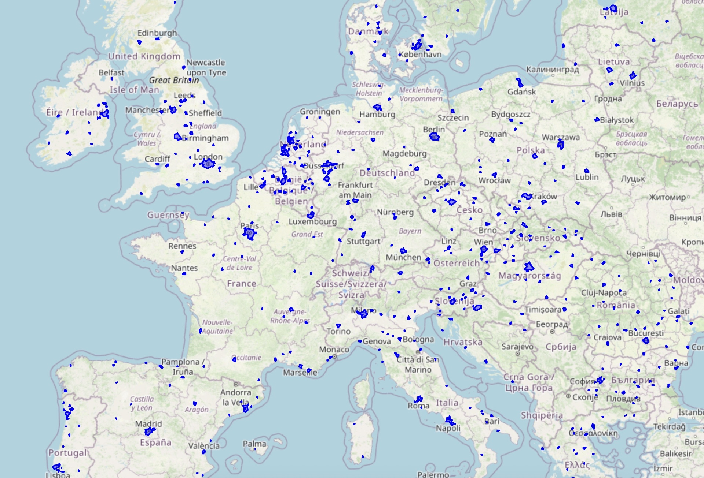

# H3 Centroid Selection CLI tool

This tool provides a command-line interface for selecting the top populated H3 hexagons by country using different allocation strategies. It wraps the get_top_centroids_by_strategy function into a flexible CLI so you can run sampling experiments directly from the terminal.

## Usage

Run the CLI tool with 

```
python samplecells.py <total_count> <resolution> [options]
```

### Required Arguments

- total_count – total number of hexagons to select.

- resolution – H3 resolution (4, 5, 6, or 8).

### Options

- --method {population,uniform,sqrt,log,threshold}
  - Allocation strategy (default: population).

- --min-per-country N
  - Minimum hexes per country (default: 0).

- --threshold N
  - Population threshold for the threshold method.

- --urban-fraction F
  - Fraction of hexes chosen from top-population cells (0.0–1.0, default: 1.0).

- --plot
  
  - Plot selected hexes on an interactive Folium map.

- --fixed-country CODE

  - ISO country code to fix allocation for.

- --fixed-count N

  - Number of hexes to allocate to the fixed country (requires --fixed-country).

- --output-csv PATH
  - Save the resulting DataFrame to a CSV file at the specified path.

### Examples

Select 3,000 hexes at resolution 6 using the default population allocation:
```
python samplecells.py 3000 6 --method population
```

Fix 50 hexes for Denmark (DNK), with the rest allocated proportionally:
```
python samplecells.py 3000 6 --fixed-country DNK --fixed-count 50
```
Use the threshold method to only consider countries with population ≥ 1,000,000:
```
python samplecells.py 1000 8 --method threshold --threshold 1000000
```
Plot results on an interactive map:
```
python samplecells.py 500 6 --plot
```
Save results to a CSV file:
```
python samplecells.py 3000 6 --output-csv top_hexes.csv
```
Combine plotting and CSV output:
```
python samplecells.py 1000 8 --plot --output-csv results.csv
```

### Output

The CLI prints:

A dictionary with allocation counts by country.

A preview of the DataFrame of selected hexes (country, H3 index, lat, lng, population, UTC offset).

If `--output-csv` is provided, the full DataFrame is saved to the specified CSV file.

Here is an example of 1500 of the most populous cells chosen from Europe using the sqrt flag and a closer look at Northern Italy.




## Library Functions (h3raster.py)

The `h3raster.py` module provides a set of utility functions for working with H3 hexagons, geographic data, and ZIP codes.

### Visualization Functions

#### `plot_df(df, map_location=None, zoom_start=11)`
Plot a GeoDataFrame on an interactive Folium map.

**Parameters:**
- `df` (GeoDataFrame): GeoDataFrame with a geometry column
- `map_location` (tuple, optional): Center of map as (lat, lon). If None, uses centroid of all geometries
- `zoom_start` (int): Initial zoom level (default: 11)

**Returns:** Opens an interactive map in the browser

#### `plot_shape(shape, map_location=None, zoom_start=11)`
Plot a Shapely geometry on an interactive Folium map.

**Parameters:**
- `shape`: Shapely geometry object
- `map_location` (tuple, optional): Center of map as (lat, lon). If None, uses centroid
- `zoom_start` (int): Initial zoom level (default: 11)

**Returns:** Opens an interactive map in the browser

#### `plot_cells(cells, ax=None)`
Plot H3 cells by converting them to a shape.

**Parameters:**
- `cells` (list): List of H3 cell IDs
- `ax` (matplotlib axis, optional): Matplotlib axis to plot on

#### `plot_shape_and_cells(shape, res=9)`
Plot a shape and its H3 cell coverage side by side for comparison.

**Parameters:**
- `shape`: Shapely geometry object
- `res` (int): H3 resolution (default: 9)

**Returns:** Matplotlib figure with two subplots

#### `folium_plot_cells(cells)`
Plot H3 cells on an interactive Folium map.

**Parameters:**
- `cells` (list): List of H3 cell IDs

**Returns:** Opens an interactive map in the browser centered at (55.7, 12.5)

#### `plot_zip(zip_code, data_dir=None, zoom_start=11)`
Plot a single ZIP code polygon on an interactive Folium map.

**Parameters:**
- `zip_code` (str): The 5-digit ZIP code to plot
- `data_dir` (Path or str, optional): Base directory for the shapefile. If not provided, assumes `data/zips/` in the script directory
- `zoom_start` (int): Initial zoom level (default: 11)

**Returns:** Opens an interactive map in the browser

**Raises:** ValueError if ZIP code is not found

### Conversion Functions

#### `h3list_to_centroids(cells)`
Convert a list of H3 cell IDs to their centroid coordinates.

**Parameters:**
- `cells` (list): List of H3 cell IDs

**Returns:** List of tuples containing (latitude, longitude) for each cell centroid

#### `zips_to_cells(zip_codes, resolution=8, data_dir=None)`
Convert one or more ZIP codes to H3 cell IDs at a specified resolution.

**Parameters:**
- `zip_codes`: A single ZIP code or a list of ZIP codes (str or int)
- `resolution` (int): The H3 resolution (default: 8)
- `data_dir` (Path or str, optional): Base directory for the shapefile. If not provided, assumes `data/zips/` in the script directory

**Returns:** List of unique H3 cell IDs covering the areas of the ZIP codes

**Raises:** ValueError if none of the provided ZIP codes are found

#### `zip_to_centroid(zip_code, resolution=8)`
Convert a ZIP code to its centroid coordinates at a specified H3 resolution.

**Parameters:**
- `zip_code`: A single ZIP code (str or int)
- `resolution` (int): The H3 resolution (default: 8)

**Returns:** Tuple containing (longitude, latitude) of the ZIP code centroid

**Raises:** ValueError if ZIP code is not found

#### `latlng_to_cell(lat, lng, resolution=8)`
Convert latitude and longitude to an H3 cell ID at a specified resolution.

**Parameters:**
- `lat` (float): Latitude of the point
- `lng` (float): Longitude of the point
- `resolution` (int): The H3 resolution (default: 8)

**Returns:** H3 cell ID corresponding to the given coordinates

#### `latlng_to_zip_centroid(lat, lng, resolution=8, data_dir=None)`
Convert latitude and longitude to the centroid of the containing ZIP code.

**Parameters:**
- `lat` (float): Latitude of the point
- `lng` (float): Longitude of the point
- `resolution` (int): The H3 resolution (default: 8)
- `data_dir` (Path or str, optional): Base directory for the shapefile. If not provided, assumes `data/zips/` in the script directory

**Returns:** Dictionary with ZIP code as key and (longitude, latitude) tuple as value

**Raises:** ValueError if no ZIP code is found for the given coordinates

### Example Usage

```python
import h3raster

# Convert a ZIP code to H3 cells
cells = h3raster.zips_to_cells("94102", resolution=9)
print(f"Found {len(cells)} H3 cells")

# Get the centroid of a ZIP code
centroid = h3raster.zip_to_centroid("94102")
print(f"Centroid: {centroid}")

# Convert lat/lng to H3 cell
cell_id = h3raster.latlng_to_cell(37.7749, -122.4194, resolution=9)
print(f"Cell ID: {cell_id}")

# Plot a ZIP code
h3raster.plot_zip("94102", zoom_start=12)

# Convert H3 cells to centroids
centroids = h3raster.h3list_to_centroids(cells)
print(f"First centroid: {centroids[0]}")
```
